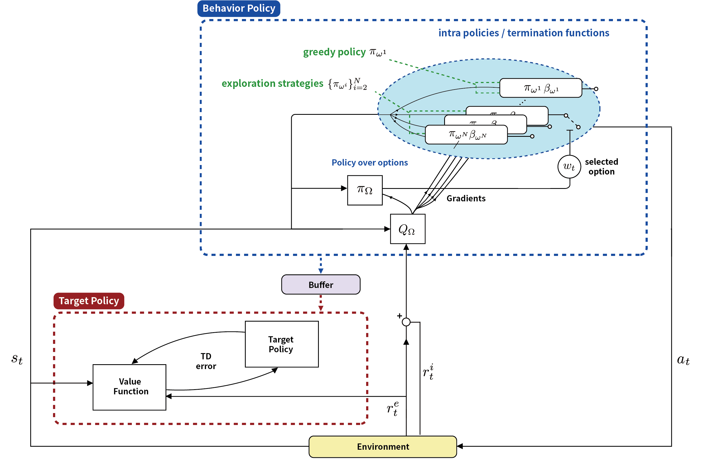

# LESSON: Learning to Integrate Exploration Strategies for Reinforcement Learning via an Option Framework

This is the code for the paper LESSON accepted at ICML'2023. The paper can be found at [[paper]](https://openreview.net/pdf?id=vXcvrYJlVm).

LESSON Architecture:

## Installation
```
git clone https://github.com/beanie00/LESSON.git
conda create -n lesson
conda activate lesson
pip3 install -r requirements.txt
```

## Training
```
python3 train.py [**arguments]
```

### arguments
* --env : Choose minigrid environment to learn from. A list of environments can be found in [https://minigrid.farama.org/environments/minigrid/](https://minigrid.farama.org/environments/minigrid/)
* --algorithm : Choose between DQN and DRQN (default : DQN)
* --seed : Select seed value
* --rnd_scale : intrinsic reward coefficient alpha
* --log_wandb : Log using wandb

### example
```
python3 train.py --env MiniGrid-LavaCrossingS9N1-v0 --rnd_scale 0 --algorithm dqn --seed 42 --log_wandb True
```

## Acknowledgements

We referred to https://github.com/schalappe/Deep-Double-Q-Learning-for-Minigrid while implementing DQN in the MiniGrid environment in our LESSON implementation.

## References
If you find our code helpful for your research, please consider citing the paper!

```
@inproceedings{kim2023lesson,
  title={LESSON: Learning to Integrate Exploration Strategies for Reinforcement Learning via an Option Framework},
  author={Kim, Woojun and Kim, Jeonghye and Sung, Youngchul},
  booktitle={International Conference on Machine Learning},
  pages={16619--16638},
  year={2023},
  organization={PMLR}
}
```
